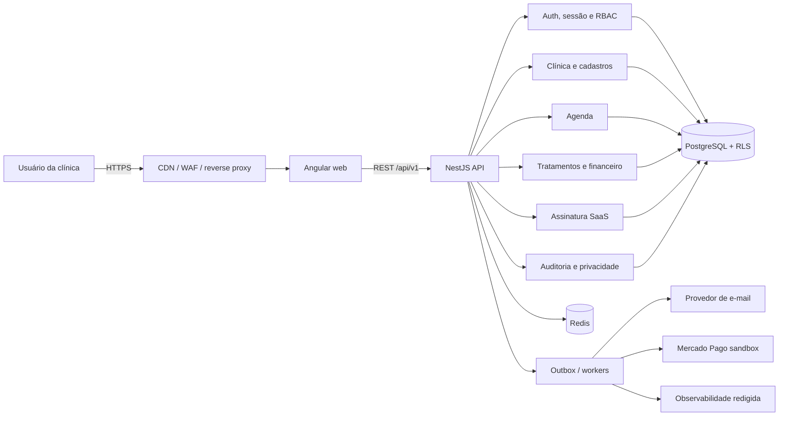
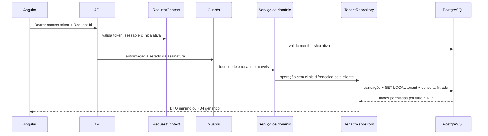
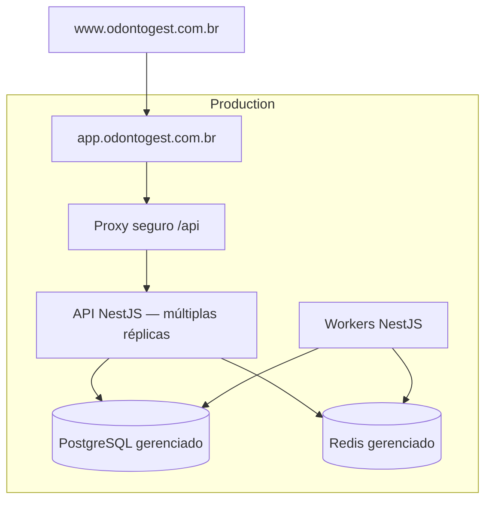

# Arquitetura proposta

## Contexto

O OdontoGest é um SaaS B2B multi-clínica. O primeiro MVP cobre cadastro,
agenda, tratamentos, contas a receber e assinatura da plataforma; prontuário
clínico, imagens, radiografias e exames permanecem fora do escopo. A arquitetura
prioriza isolamento entre tenants, consistência financeira, rastreabilidade e
capacidade de operação por uma equipe pequena.

## Decisão de alto nível

O sistema começa como **monólito modular** no backend, com frontend e API
implantáveis separadamente. Isso preserva limites de domínio e transações locais
sem assumir o custo operacional de microserviços. Módulos só poderão se comunicar
por APIs públicas internas; jobs assíncronos usarão eventos/outbox.



## Estrutura do monorepo

```text
apps/
  web/
    src/app/core/          # autenticação, HTTP, guards e shell
    src/app/features/      # módulos lazy por domínio
    src/app/shared/        # componentes visuais sem regra de negócio
    src/styles/            # tema e tokens
  api/
    src/modules/           # módulos NestJS por domínio
    src/platform/          # banco, fila, e-mail, billing, storage e observabilidade
    src/common/            # filtros, pipes, guards e contexto da requisição
    prisma/                # schema, migrações e seeds fictícios
packages/
  contracts/               # cliente/tipos gerados do OpenAPI
docs/
```

O workspace adotará pnpm e orquestração de tarefas na Fase 1. Cada app terá
configuração TypeScript estrita e fronteiras verificadas por lint. O pacote de
contratos será gerado da especificação OpenAPI; DTOs de persistência e código do
servidor não serão importados pelo frontend.

## Módulos do backend

| Módulo         | Responsabilidade                              | Não pode fazer                              |
| -------------- | --------------------------------------------- | ------------------------------------------- |
| Identity       | User, senha, e-mail e recuperação             | Escolher tenant sem validar membership      |
| Sessions       | RefreshSession, rotação e revogação           | Persistir token em claro                    |
| Tenancy        | Clinic, Membership e clínica ativa            | Aceitar `clinicId` como escopo de negócio   |
| Authorization  | Role, Permission e políticas                  | Confiar em ocultação do frontend            |
| Patients       | Cadastro e exportação autorizada              | Editar status financeiro manualmente        |
| Dentists       | CRO, vínculo com usuário e horários           | Consultar outra clínica                     |
| Procedures     | Catálogo e preços padrão                      | Definir o total final de uma venda          |
| Scheduling     | Consultas, bloqueios e histórico              | Resolver conflito apenas em memória         |
| Treatments     | Orçamentos, itens e aprovação                 | Usar valores enviados como fonte de verdade |
| Clinic Finance | Receivables, Payment e Reversal               | Apagar pagamento confirmado                 |
| SaaS Billing   | Plano, assinatura, uso e webhook              | Misturar cobrança SaaS com paciente         |
| Audit          | Eventos imutáveis e redação                   | Registrar segredo ou dado pessoal excessivo |
| Privacy        | Exportação, correção, retenção e anonimização | Excluir sem política e autorização          |
| Notifications  | E-mail e avisos via fila                      | Bloquear transação esperando provedor       |

## Fluxo de requisição autenticada



### Contexto de tenant

- O seletor de clínica envia somente um **candidato não confiável**. O servidor
  valida a membership ativa antes de gravar `activeClinicId` na sessão e emitir um
  novo access token.
- Em todas as demais rotas, `clinicId` vem do contexto autenticado. Campos com esse
  nome no body/query são rejeitados pelo `ValidationPipe` com whitelist estrita.
- Controllers chamam serviços de aplicação; somente repositories tenant-aware
  recebem o contexto interno.
- A role da aplicação usa `NOBYPASSRLS`. A role de migração, separada, é a única que
  pode alterar políticas.
- `SET LOCAL app.current_clinic_id` ocorre dentro da transação, evitando vazamento
  entre conexões do pool.
- Entidades globais explicitamente documentadas (`User`, catálogo de `Plan`,
  `Permission`) não usam RLS de clínica; relações tenant possuem `clinicId`.

## Autenticação e sessão

1. Senhas recebem Argon2id com parâmetros versionados e calibrados no ambiente.
2. O access token tem vida curta, fica apenas em memória e contém identificadores
   mínimos (`sub`, sessão, clínica ativa e versão de autorização).
3. O refresh token aleatório fica em cookie HttpOnly, Secure, SameSite=Strict,
   host-only e com Path restrito aos endpoints de autenticação.
4. O banco guarda apenas hash do refresh token, família, predecessor, expirações,
   IP reduzido e user agent limitado.
5. Cada refresh rotaciona o token numa transação. Reutilização de um token anterior
   revoga toda a família e gera auditoria/alerta.
6. Logout revoga a sessão atual; logout global incrementa a versão de sessão do
   usuário e revoga todas as famílias.
7. Endpoints baseados em cookie validam `Origin` contra allowlist. CORS nunca usa
   wildcard com credenciais.
8. Respostas de login, cadastro e recuperação são genéricas para reduzir enumeração.

O deploy preferencial usa proxy `/api` na mesma origem do app. Caso `app` e `api`
fiquem em subdomínios diferentes, ambos devem pertencer ao mesmo site registrável,
com allowlist exata e testes de cookie no navegador real.

## Persistência e consistência

- PostgreSQL é a fonte de verdade; valores monetários usam `bigint` em centavos.
- UUIDs são gerados no servidor/banco. Datas são `timestamptz` em UTC.
- Prisma executa queries parametrizadas, mas migrações SQL manuais criam RLS,
  índices parciais e constraints de exclusão não expressáveis no schema.
- Aprovação de venda, geração de parcelas, pagamento, estorno, onboarding e rotação
  de refresh são transações atômicas.
- Agenda usa `tstzrange` e constraint de exclusão por clínica/dentista; validação de
  aplicação melhora a mensagem, mas o banco decide concorrência.
- `Payment` tem unicidade `(clinicId, idempotencyKey)` e não sofre delete físico.
- `WebhookEvent` tem unicidade `(provider, providerEventId)` e processamento com
  estados `RECEIVED`, `PROCESSING`, `PROCESSED`, `FAILED`.
- Outbox é gravada na mesma transação do evento de negócio e publicada pelo worker.

## Frontend

- Angular com standalone components, lazy loading, signals para estado local e
  Reactive Forms.
- `AuthStore` guarda access token apenas em memória. Ao recarregar, o app tenta uma
  renovação silenciosa por cookie antes de liberar rotas autenticadas.
- Um interceptor adiciona Bearer/request ID e coordena uma única tentativa de
  refresh; loops de 401 são bloqueados.
- `PermissionGuard` e diretiva melhoram UX, mas a API continua sendo autoridade.
- `SubscriptionGuardComponent` explica modo somente leitura e preserva acesso à
  cobrança e exportação.
- Preferências visuais não sensíveis podem usar LocalStorage com namespace e versão.
- Respostas paginadas usam cursor onde ordenação for estável e offset apenas quando
  a UX exigir páginas numeradas.

## Segurança de borda e API

- TLS obrigatório; HSTS somente após validação de todos os subdomínios.
- CSP por nonce/hash, `frame-ancestors 'none'`, `X-Content-Type-Options: nosniff`,
  política de referrer restritiva e Permissions Policy mínima.
- Body JSON limitado; uploads permanecem desabilitados no MVP.
- Rate limiting distribuído no Redis por rota, IP normalizado e identificador de
  conta quando disponível; login adiciona atraso progressivo.
- `ValidationPipe` transforma e rejeita propriedades desconhecidas; DTOs de escrita
  são específicos por caso de uso para evitar mass assignment.
- Stack traces não chegam ao cliente em produção. Todo erro possui código estável e
  request ID sem revelar existência cross-tenant.
- OpenAPI fica desabilitado por padrão em produção e, quando habilitado, exige rede
  ou autenticação administrativa separada.

O baseline verificável será OWASP ASVS 5.0.0, cuja finalidade é servir de base para
testar controles técnicos e orientar requisitos de desenvolvimento:
<https://owasp.org/www-project-application-security-verification-standard/>.

## Observabilidade

- JSON logs com request ID, trace ID, serviço, rota normalizada, status, duração e
  identificadores internos permitidos.
- Redaction por denylist e testes: `authorization`, `cookie`, senha, token, CPF,
  CNPJ, e-mail, telefone, endereço, observações e payloads financeiros completos.
- Métricas agregadas não recebem nomes de pacientes, IDs externos ou valores
  individuais.
- Health (`liveness`) verifica processo; readiness verifica dependências críticas
  com timeouts curtos. Falha do provedor de e-mail não derruba leitura da API.
- OpenTelemetry e Sentry entram por adapters; envio de payload de request fica
  desabilitado por padrão.

## Ambientes e segredos

Development, Demo, Staging e Production possuem contas, bancos, Redis, buckets e
credenciais separados. Demo nunca aponta para produção e pode ser resetada por job
autorizado. Segredos vêm do secret manager da plataforma; `.env.example` conterá
somente nomes e exemplos inertes na Fase 1.

## Implantação proposta



Frontend pode ser servido por Vercel ou equivalente e a API por plataforma com
processo Node persistente. A escolha comercial será feita após medir região,
backups, SLA, pool de conexões, egress e suporte a restore point-in-time. Não há
infraestrutura ou backup configurado na Fase 0.

## Requisitos de qualidade por mudança

- lint, formatação e TypeScript strict;
- testes unitários do domínio alterado;
- integração real com PostgreSQL/Redis quando invariantes dependerem deles;
- testes tenant e autorização para todo endpoint de negócio;
- migração forward e rollback operacional documentado;
- OpenAPI compatível ou mudança explicitamente versionada;
- build reprodutível com lockfile;
- análise de segredo e dependências no CI.
