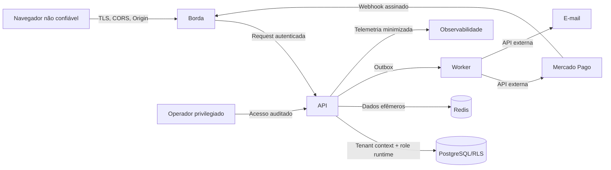

# Modelo de ameaças

Versão: 0.1 — Fase 0
Método: STRIDE + abuse cases + análise de privacidade
Baseline: OWASP ASVS 5.0.0

## Escopo e premissas

Este modelo cobre navegador Angular, API NestJS, PostgreSQL, Redis, workers,
e-mail, Mercado Pago, observabilidade e operadores administrativos. Não cobre
prontuário, radiografias, imagens ou upload, pois estão fora do MVP. Ameaças devem
ser reavaliadas quando arquitetura, provedor ou dados mudarem.

A documentação não equivale a teste de invasão, DPIA/RIPD ou parecer jurídico. O
OWASP ASVS fornece base para requisitos e verificação técnica, mas aderência só
pode ser afirmada após evidências de implementação e teste:
<https://owasp.org/www-project-application-security-verification-standard/>.

## Ativos críticos

| Ativo                                   | Impacto de confidencialidade | Integridade | Disponibilidade |
| --------------------------------------- | :--------------------------: | :---------: | :-------------: |
| Identidade, senha e sessões             |           Crítico            |   Crítico   |      Alto       |
| Cadastro e contato de pacientes         |           Crítico            |    Alto     |      Alto       |
| Agenda e vínculo paciente/dentista      |             Alto             |    Alto     |      Alto       |
| Vendas, parcelas, pagamentos e estornos |             Alto             |   Crítico   |      Alto       |
| Memberships, papéis e permissões        |             Alto             |   Crítico   |      Alto       |
| Assinatura e limites do SaaS            |            Médio             |   Crítico   |      Alto       |
| Auditoria e aceites                     |             Alto             |   Crítico   |      Médio      |
| Segredos e chaves criptográficas        |           Crítico            |   Crítico   |      Alto       |
| Backups e exports                       |           Crítico            |    Alto     |      Médio      |

## Atores e capacidades

- Usuário legítimo de uma clínica, com um dos cinco papéis.
- Usuário legítimo mal-intencionado tentando elevar privilégio ou trocar tenant.
- Atacante remoto sem conta realizando enumeração, brute force, exploração web ou
  abuso de disponibilidade.
- Atacante com sessão, caixa de e-mail ou dispositivo comprometido.
- Provedor externo comprometido ou webhook falsificado.
- Operador de suporte/infra com acesso privilegiado.
- Dependência ou pipeline comprometido.
- Erro humano em configuração, migração, restore ou exportação.

## Fronteiras de confiança

Tudo recebido do navegador, webhook, fila, cache, arquivo de configuração e
provedor é não confiável até validação. Redis não é fonte de autorização nem de
saldo financeiro.

## Abuse cases prioritários

### AC-01 — Acesso cross-tenant

Atacante da Clínica B usa UUID conhecido da Clínica A em URL, body, query,
paginação ou relação aninhada.

Controles: tenant do contexto autenticado; rejeição de `clinicId`; repository
central; foreign keys compostas; RLS; respostas 404 genéricas; testes em todos os
endpoints e jobs. Criticidade: **crítica**.

### AC-02 — Sequestro/replay de sessão

XSS ou malware rouba access token em memória; invasor tenta reutilizar refresh
antigo ou manter sessão após logout.

Controles: CSP, sem token em storage, access curto, cookie HttpOnly/Secure,
rotação/família, hash em banco, revogação, expiração absoluta, reautenticação e MFA
futuro. Criticidade: **crítica**.

### AC-03 — Pagamento duplicado ou saldo manipulado

Cliente repete request, troca valor/receivable, explora timeout ou concorrência.

Controles: valor recalculado; idempotency key + fingerprint; transação; row lock;
constraints; append-only; estorno; auditoria; teste concorrente. Criticidade:
**crítica**.

### AC-04 — Duplo agendamento

Duas recepcionistas reservam o mesmo dentista/horário quase simultaneamente.

Controles: validação rápida no serviço e constraint de exclusão no PostgreSQL;
transação e tradução do erro para conflito útil. Criticidade: **alta**.

### AC-05 — Webhook falso, repetido ou fora de ordem

Atacante tenta ativar plano; provedor entrega o mesmo evento várias vezes ou um
evento antigo depois de outro novo.

Controles: assinatura e timestamp conforme documentação do provedor; evento único;
consulta server-to-server; máquina de estados monotônica; fila idempotente;
reconciliação. Redirect nunca ativa assinatura. Criticidade: **crítica**.

### AC-06 — Abuso de exportação e suporte

Usuário privilegiado exporta cadastros em massa ou operador acessa clínica sem
justificativa.

Controles: permissão específica, reautenticação, justificativa, export assíncrono
criptografado com expiração, limite de frequência, auditoria, notificação e acesso
de suporte just-in-time. Criticidade: **crítica**.

### AC-07 — Vazamento por logs/telemetria

DTO, exceção, URL, query ou payload externo carrega CPF, e-mail, telefone, token,
observação ou valor individual para logs.

Controles: allowlist de campos, middleware de redaction, rotas sem PII na URL,
captura de body desabilitada, testes canário e retenção reduzida. Criticidade:
**alta**.

## Registro STRIDE

| ID  | Categoria    | Cenário                                      | Controle planejado                                                | Teste/evidência                | Risco residual |
| --- | ------------ | -------------------------------------------- | ----------------------------------------------------------------- | ------------------------------ | -------------- |
| T01 | Spoofing     | Credential stuffing no login                 | Rate limit Redis, atraso progressivo, mensagem genérica, alerta   | teste de limite e enumeração   | Médio          |
| T02 | Spoofing     | Reuso de refresh roubado                     | Rotação, família, hash e revogação                                | concorrência/replay            | Médio          |
| T03 | Spoofing     | Webhook forjado                              | Validação oficial da assinatura e consulta ao provedor            | vetor válido/inválido/replay   | Baixo          |
| T04 | Tampering    | `clinicId`/IDs aninhados adulterados         | DTO estrito, contexto tenant, FK composta, RLS                    | suíte cross-tenant             | Baixo          |
| T05 | Tampering    | Total/desconto/parcela enviados pelo cliente | Recalcular no domínio e transação                                 | testes com valores adulterados | Baixo          |
| T06 | Tampering    | Status financeiro manual                     | Projeção server-side a partir de receivables                      | contrato não aceita campo      | Baixo          |
| T07 | Tampering    | Evento de auditoria alterado                 | Role sem update/delete, append-only, retenção e hash futuro       | teste de permissão DB          | Médio          |
| T08 | Repudiation  | Usuário nega estorno/cancelamento            | Auditoria com ator, request, antes/depois redigido                | teste de trilha completa       | Baixo          |
| T09 | Repudiation  | Aceite de termos sem evidência               | Versão, data, usuário e evidence digest                           | teste de onboarding atômico    | Baixo          |
| T10 | Disclosure   | IDOR cross-tenant                            | Filtro + RLS + 404 genérico                                       | Clínica A/B obrigatório        | Baixo          |
| T11 | Disclosure   | XSS exfiltra dados/tokens                    | Angular encoding, CSP, sem HTML arbitrário, token em memória      | testes CSP/XSS                 | Médio          |
| T12 | Disclosure   | Backup/export público                        | Criptografia, bucket privado, URL curta, acesso auditado          | restore/export drill           | Médio          |
| T13 | Disclosure   | Logs contêm PII                              | Redaction allowlist e testes canário                              | scanner de logs                | Baixo          |
| T14 | DoS          | Login/relatórios/exports caros               | Rate limit, paginação, fila, timeout e budget                     | carga e abuso                  | Médio          |
| T15 | DoS          | Worker preso em webhook ruim                 | Retry com backoff, DLQ, circuit breaker, payload limitado         | chaos/retry test               | Médio          |
| T16 | Elevation    | Frontend oculta botão, API permite           | Guard backend default-deny                                        | matriz por papel               | Baixo          |
| T17 | Elevation    | Membership revogada continua no JWT          | Revalidação/versionamento e access curto                          | revogação imediata             | Baixo          |
| T18 | Elevation    | Role do banco ignora RLS                     | Runtime `NOBYPASSRLS`, owner separado                             | teste de conexão runtime       | Baixo          |
| T19 | Supply chain | Pacote/build malicioso                       | Lockfile, provenance quando disponível, SCA, CodeQL e secret scan | CI bloqueante                  | Médio          |
| T20 | Configuração | CORS wildcard ou Swagger público             | Config schema fail-fast e teste de ambiente                       | teste de config prod           | Baixo          |

## Requisitos de segurança derivados

### Autenticação

- Hash Argon2id versionado; parâmetros medidos e revisáveis.
- Senha mínima orientada a comprimento, bloqueio de senhas comprometidas na fase
  definida e compatibilidade com gerenciadores/colar.
- Tokens aleatórios de alta entropia, uso único e hash em repouso.
- Rate limit não deve virar bloqueio permanente explorável contra a vítima.
- OWNER e ADMIN terão arquitetura para TOTP/recovery codes; rollout e recuperação
  exigem ameaça específica antes da produção.

Referência: <https://cheatsheetseries.owasp.org/cheatsheets/Authentication_Cheat_Sheet.html>.

### Autorização e tenant

- Default deny; permission code por caso de uso.
- Tenant context não pode ser sobrescrito por DTO, interceptor de cliente ou job.
- Jobs carregam `clinicId` no envelope interno assinado/validado e reabrem contexto
  RLS; não executam query global acidental.
- Endpoints de lookup validam todas as relações como pertencentes ao tenant.
- Métricas de negação usam rota normalizada e não IDs/PII.

### Financeiro e cobrança

- Aprovação, pagamento e estorno exigem idempotência, transação e auditoria.
- Webhook responde rápido após persistência/deduplicação e processa em fila.
- A origem do webhook deve ser validada conforme o provedor. O Mercado Pago
  documenta assinatura secreta e headers próprios:
  <https://www.mercadopago.com.br/developers/pt/docs/your-integrations/notifications/webhooks>.
- Credenciais sandbox e produção são isoladas; cartão nunca passa pela aplicação.

### Privacidade

- PII não aparece em path, logs, traces, nomes de fila ou chaves de cache.
- Exports têm escopo, motivo, expiração, criptografia e trilha.
- Auditoria armazena mudança necessária, não cópia indiscriminada do registro.
- Retenção é configurável e juridicamente revisada; anonimização preserva apenas o
  necessário para obrigações e integridade financeira.

## Plano de verificação

| Gate         | Evidência mínima antes de produção                                     |
| ------------ | ---------------------------------------------------------------------- |
| Tenant       | suíte automática A/B para todos os resources + teste direto de RLS     |
| Sessão       | rotação, replay, logout, expiração, concorrência e CORS em navegador   |
| RBAC         | matriz positiva/negativa e revogação de role durante sessão            |
| Agenda       | duas transações concorrentes; exatamente uma reserva vence             |
| Financeiro   | duplicidade, retry, rollback e estorno com invariantes                 |
| Billing      | assinatura válida/inválida, duplicidade, ordem e reconciliação sandbox |
| Logs         | canários de CPF/e-mail/token ausentes em logs e erro tracking          |
| Supply chain | SCA, secret scan, CodeQL e imagem/lockfile revisados                   |
| Operação     | restore testado, rotação de segredo e resposta a incidente em tabletop |

## Riscos residuais e decisões pendentes

- Shared schema mantém blast radius maior que database-per-tenant; RLS reduz, mas
  não elimina risco de role privilegiada ou migração incorreta.
- Aplicação web não controla malware no dispositivo; expiração curta, MFA e
  revogação reduzem impacto.
- RLS com Prisma precisa de prova técnica na Fase 1; qualquer caminho que não
  estabeleça `SET LOCAL` deve falhar fechado.
- Política de retenção, base legal, papéis de controlador/operador e conteúdo dos
  termos exigem revisão jurídica antes do lançamento.
- Estratégia de suporte a clínicas e restore seletivo precisa de desenho
  operacional nas Fases 6–7.
- Parâmetros de rate limit, Argon2id e expiração só serão fixados após benchmark e
  teste de usabilidade/abuso.

## Critério de atualização

Revisar este documento a cada nova categoria de dado, integração, upload,
prontuário, app móvel, mudança de autenticação, extração de serviço ou incidente.
