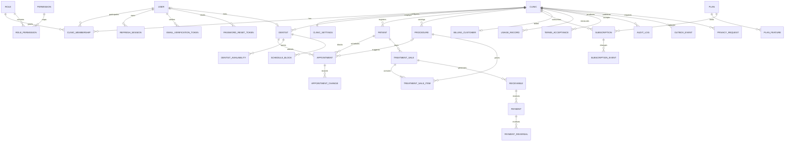

# Modelo de dados proposto

## Convenções

- IDs: UUID, sem identificadores sequenciais expostos.
- Tempo: `timestamptz` em UTC; apresentação no fuso da clínica.
- Dinheiro: `bigint` em centavos, nunca `float`.
- Tenant: tabelas marcadas **T** exigem `clinic_id`, RLS e índice iniciado por ele.
- Auditoria: **T** recebe `created_at`, `updated_at`, `created_by` e `updated_by`
  quando aplicável; `deleted_at` apenas onde soft delete tem semântica segura.
- Nomes do banco usam `snake_case`; domínio TypeScript usa `camelCase`.
- CPF/CNPJ são normalizados, validados e cifrados em campo próprio. Busca e
  unicidade usam blind index HMAC com chave separada e rotacionável.
- E-mail canônico serve a busca; o valor de apresentação não aparece em logs.

## Diagrama de entidades

O diagrama omite campos técnicos e tabelas auxiliares para permanecer legível.



## Identidade, tenant e autorização

### User — global

`id`, `email`, `email_canonical`, `password_hash`, `password_hash_version`,
`status`, `email_verified_at`, `failed_login_count`, `locked_until`,
`session_version`, `last_login_at`, `created_at`, `updated_at`, `deleted_at`.

Constraints: `unique(email_canonical)` apenas para usuários não excluídos. A
resposta da API nunca inclui `password_hash`.

### Clinic — raiz do tenant

`id`, `legal_name`, `trade_name`, `document_type`, `document_ciphertext`,
`document_blind_index`, `phone_ciphertext`, `status`, `timezone`, `locale`,
`currency`, `data_retention_policy_id`, `created_at`, `updated_at`, `deleted_at`.

Defaults: `timezone=America/Sao_Paulo`, `locale=pt-BR`, `currency=BRL`.

### ClinicMembership — T

`id`, `clinic_id`, `user_id`, `role_id`, `status`, `invited_by`, `invited_at`,
`accepted_at`, `authorization_version`, campos técnicos.

Constraints: `unique(clinic_id, user_id)` para membership ativa. OWNER não pode
ser removido sem transferência transacional de propriedade.

### Role, Permission e RolePermission

`Role`: `id`, `code`, `name`, `scope`, `clinic_id?`, `is_system`, timestamps.
`Permission`: `id`, `code`, `description`, `risk_level`.
`RolePermission`: `role_id`, `permission_id`.

Os cinco papéis iniciais são system roles. `clinic_id` opcional prepara papéis
customizados futuros; somente OWNER poderá administrá-los. Códigos são estáveis e
não dependem do rótulo traduzido.

### RefreshSession

`id`, `user_id`, `active_clinic_id`, `family_id`, `token_hash`,
`previous_token_hash`, `status`, `issued_at`, `last_used_at`, `idle_expires_at`,
`absolute_expires_at`, `revoked_at`, `revoke_reason`, `ip_prefix`,
`user_agent_summary`, `created_at`, `updated_at`.

`token_hash` é único. A família é revogada quando um predecessor reaparece. A
clínica ativa precisa continuar associada ao usuário a cada refresh.

### EmailVerificationToken e PasswordResetToken

`id`, `user_id`, `token_hash`, `expires_at`, `consumed_at`, `attempt_count`,
`created_at`. Hash único, expiração curta e uso único. O reset revoga todas as
sessões após alterar a senha.

## Configuração e cadastros

### ClinicSettings — T

`id`, `clinic_id`, `default_appointment_minutes`, `grace_period_days`,
`receivable_overdue_job_time`, `retention_policy`, `schedule_settings`,
`notification_settings`, `version`, campos técnicos.

Campos estruturados começam tipados; JSONB só é permitido para configuração
extensível sem invariantes financeiras.

### Dentist — T

`id`, `clinic_id`, `user_id?`, `name`, `cro`, `cro_state`, `specialty`,
`phone_ciphertext`, `email_ciphertext`, `calendar_color`,
`default_appointment_minutes`, `status`, campos técnicos.

Constraints: `unique(clinic_id, cro_state, cro)` entre ativos e
`unique(clinic_id, user_id)` quando houver vínculo.

### DentistAvailability e ScheduleBlock — T

Availability guarda `dentist_id`, dia da semana, início/fim local, validade e
intervalos. Block guarda `dentist_id`, `starts_at`, `ends_at`, motivo administrativo
curto e autor. A regra de não sobreposição usa a mesma estratégia da agenda.

### Patient — T

`id`, `clinic_id`, `full_name`, `cpf_ciphertext?`, `cpf_blind_index?`, `birth_date`,
`phone_ciphertext`, `whatsapp_ciphertext?`, `email_ciphertext?`, `address_ciphertext?`,
`administrative_notes_ciphertext?`, `registration_status`, `consent_flags`,
campos técnicos.

O status financeiro **não é coluna editável**. A API calcula `UP_TO_DATE`,
`PENDING` ou `OVERDUE` por projeção de `Receivable`. Uma projeção materializada
pode ser adicionada depois, com reconciliação e nunca como fonte primária.

Constraints: `unique(clinic_id, cpf_blind_index)` parcial para CPF não nulo e
paciente não excluído.

### Procedure — T

`id`, `clinic_id`, `name`, `category`, `description`, `default_amount_cents`,
`duration_minutes`, `status`, campos técnicos.

Checks: valor `>= 0`; duração em intervalo configurado. Índice por
`(clinic_id, status, normalized_name)`.

## Agenda

### Appointment — T

`id`, `clinic_id`, `patient_id`, `dentist_id`, `procedure_id?`, `starts_at`,
`ends_at`, `status`, `source`, `administrative_notes_ciphertext?`,
`scheduled_by`, `completed_at?`, `cancelled_at?`, campos técnicos.

Foreign keys tenant-safe usam chaves compostas, por exemplo
`(clinic_id, patient_id) -> patient(clinic_id, id)`, impedindo relações cruzadas
mesmo em caso de erro de aplicação.

Checks: `ends_at > starts_at`; transições de status seguem máquina de estados. Uma
coluna gerada `slot=tstzrange(starts_at, ends_at, '[)')` recebe constraint:

```sql
EXCLUDE USING gist (
  clinic_id WITH =,
  dentist_id WITH =,
  slot WITH &&
)
WHERE (deleted_at IS NULL AND status <> 'CANCELLED');
```

A migração habilita `btree_gist`. O PostgreSQL documenta constraints de exclusão
com ranges para impedir sobreposição:
<https://www.postgresql.org/docs/17/rangetypes.html>.

### AppointmentChange — T

Registro append-only com `appointment_id`, `change_type`, `from_status?`,
`to_status?`, `previous_starts_at?`, `new_starts_at?`, `reason?`, `actor_user_id` e
timestamp. Não substitui o `AuditLog`; oferece histórico operacional da agenda.

## Tratamentos e financeiro da clínica

### TreatmentSale — T

`id`, `clinic_id`, `patient_id`, `status`, `subtotal_cents`, `discount_cents`,
`total_cents`, `payment_method`, `installment_count`, `first_due_date`,
`administrative_notes`, `approved_at`, `cancelled_at`, `cancellation_reason`,
campos técnicos.

Checks: totais não negativos; `total = subtotal - discount`; venda aprovada não
sofre delete. Alterações após aprovação usam eventos/cancelamento definidos.

### TreatmentSaleItem — T

`id`, `clinic_id`, `sale_id`, `procedure_id`, `description_snapshot`, `quantity`,
`unit_amount_cents`, `discount_cents`, `subtotal_cents`, campos técnicos.

Preço e descrição são snapshot calculado no servidor para preservar histórico.

### Receivable — T

`id`, `clinic_id`, `patient_id`, `sale_id`, `installment_number`, `amount_cents`,
`due_date`, `status`, `cancelled_at?`, campos técnicos.

`OVERDUE` é determinado pelo backend quando `due_date` passou e saldo aberto é
positivo. `received_cents` é soma dos pagamentos válidos menos estornos, não um
valor aceito do navegador.

Constraints: `unique(clinic_id, sale_id, installment_number)` e valor `> 0`.

### Payment — T

`id`, `clinic_id`, `receivable_id`, `amount_cents`, `method`, `paid_at`,
`idempotency_key`, `request_fingerprint`, `status`, `recorded_by`, campos técnicos.

Constraints: `unique(clinic_id, idempotency_key)`. Repetição com o mesmo fingerprint
retorna o resultado anterior; chave igual com conteúdo diferente retorna conflito.

### PaymentReversal — T

`id`, `clinic_id`, `payment_id`, `amount_cents`, `reason`, `reversed_by`,
`reversed_at`, campos técnicos. Append-only, com soma de estornos limitada ao valor
confirmado do pagamento.

## Assinatura do SaaS

Essas tabelas nunca referenciam Patient, TreatmentSale, Receivable ou Payment.

### Plan e PlanFeature — globais

`Plan`: `id`, `code`, `name`, `status`, `price_cents`, `billing_period`,
`provider_price_ref?`, `version`, timestamps.
`PlanFeature`: `id`, `plan_id`, `feature_code`, `limit_value?`, `enabled`, timestamps.

Limites são dados versionados. Mudança de preço cria nova versão para não alterar
assinaturas existentes silenciosamente.

### Subscription — T

`id`, `clinic_id`, `plan_id`, `status`, `provider`, `provider_subscription_id?`,
`trial_starts_at`, `trial_ends_at`, `current_period_start`, `current_period_end`,
`grace_period_ends_at?`, `cancel_at_period_end`, campos técnicos.

Somente webhook/reconciliação confirmada ativa plano pago. Redirect do navegador
jamais atualiza o status.

### BillingCustomer — T

`id`, `clinic_id`, `provider`, `provider_customer_id`, campos técnicos. Não guarda
cartão, CVV ou dados de pagamento hospedado.

### WebhookEvent — global de integração

`id`, `provider`, `provider_event_id`, `event_type`, `signature_valid`,
`payload_digest`, `payload_minimized_encrypted?`, `status`, `attempt_count`,
`next_attempt_at`, `received_at`, `processed_at`, `last_error_code`.

`unique(provider, provider_event_id)`. O payload completo só é retido se necessário
e com prazo definido; logs guardam apenas digest/metadados. A documentação oficial
do Mercado Pago exige validar a assinatura secreta do webhook:
<https://www.mercadopago.com.br/developers/pt/docs/your-integrations/notifications/webhooks>.

### UsageRecord e SubscriptionEvent — T

UsageRecord: `feature_code`, janela, `quantity`, fonte e unicidade da medição.
SubscriptionEvent é append-only para trial, upgrade, downgrade, tolerância,
suspensão, cancelamento e reativação.

## Privacidade, termos e auditoria

### TermsAcceptance — T

`id`, `clinic_id`, `user_id`, `document_type`, `document_version`, `accepted_at`,
`ip_prefix`, `user_agent_summary`, `evidence_digest`. Unicidade por usuário,
clínica, documento e versão.

### AuditLog — T

`id`, `clinic_id`, `actor_user_id?`, `action`, `entity_type`, `entity_id?`,
`outcome`, `request_id`, `ip_prefix`, `user_agent_summary`, `before_redacted?`,
`after_redacted?`, `metadata_redacted?`, `occurred_at`, `hash_chain?`.

Append-only. Senha, token, documentos completos, observações e payload financeiro
detalhado são removidos antes da persistência. Falhas antes da seleção de clínica
usam stream de segurança global separado.

### PrivacyRequest e RetentionPolicy — T

PrivacyRequest acompanha acesso, correção, portabilidade, anonimização ou exclusão,
com identidade verificada, base da decisão, aprovações e evidências. RetentionPolicy
versiona prazos por categoria; execução gera relatório e auditoria.

### OutboxEvent — T opcional

`id`, `clinic_id?`, `aggregate_type`, `aggregate_id`, `event_type`,
`payload_minimized`, `occurred_at`, `published_at`, `attempt_count`,
`next_attempt_at`, `last_error_code`. Payload segue minimização e criptografia.

## Índices mínimos

- Todas as listas: `(clinic_id, deleted_at, created_at desc, id)` ou equivalente.
- Paciente: `(clinic_id, registration_status, full_name, id)` e blind index de CPF.
- Agenda: `(clinic_id, dentist_id, starts_at)` e `(clinic_id, patient_id, starts_at)`.
- Receivables: `(clinic_id, status, due_date, id)` e `(clinic_id, patient_id, due_date)`.
- Pagamentos: `(clinic_id, paid_at, id)` e idempotência única.
- Auditoria: `(clinic_id, occurred_at desc, id)`, ator e entidade.
- Sessões: `(user_id, status, absolute_expires_at)` e hashes únicos.
- Webhook: evento único, `(status, next_attempt_at)` para worker.

Cada índice será confirmado com `EXPLAIN` e dados sintéticos; não serão adicionados
índices apenas por intuição.

## Regras de exclusão e retenção

- Catálogos e cadastros podem usar soft delete quando referências históricas
  precisam permanecer.
- Venda aprovada, receivable, payment, reversal, subscription event, auditoria e
  aceite de termos são append-only/canceláveis, nunca apagados por CRUD comum.
- Solicitações LGPD não executam cascata cega. Um workflow classifica obrigação
  legal, anonimização possível, bloqueio e prazo antes da ação.
- A política jurídica final e os prazos exigem revisão profissional antes da
  produção.
